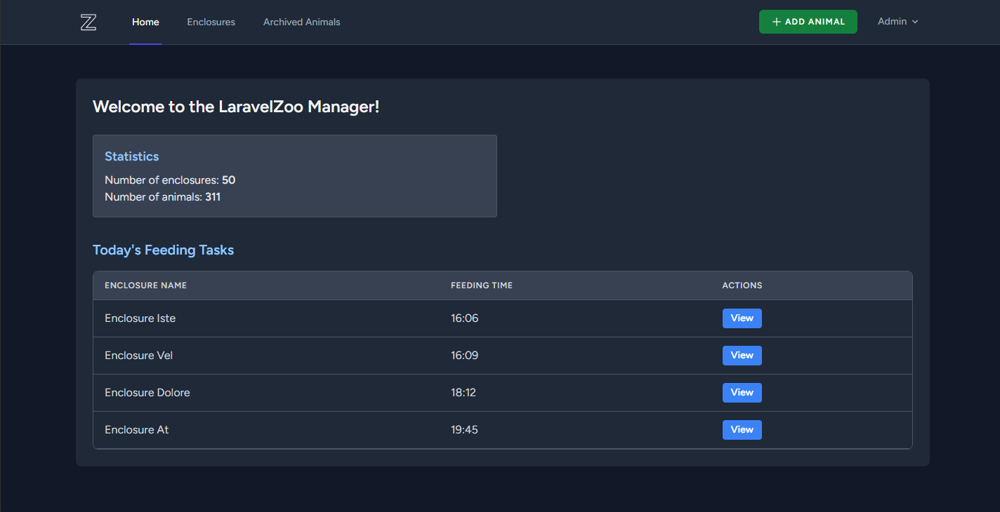
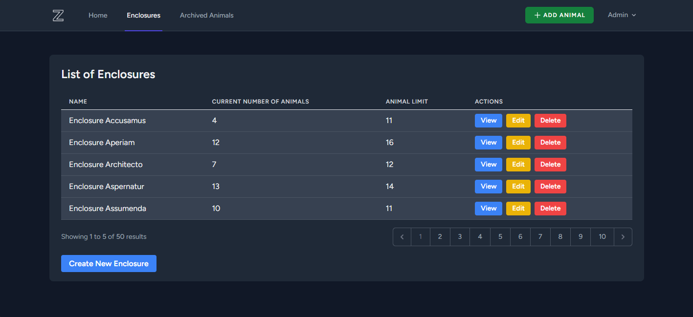
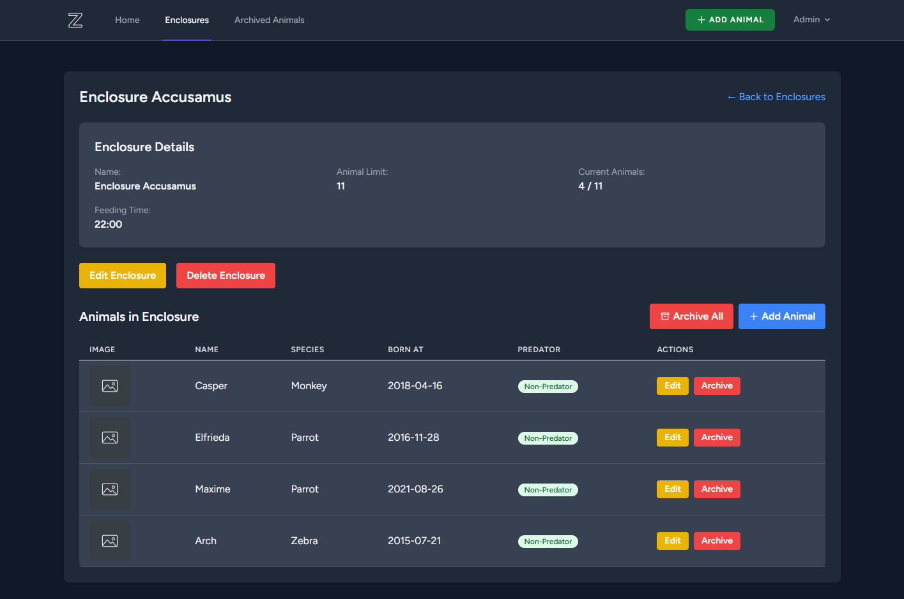

# 🐾 LaravelZoo Manager - Zoo Management System

A Laravel-based zoo management system developed as a university project. The application provides features for both zookeepers and administrators to manage enclosures, animal records, and daily tasks efficiently.

## 🚀 Features

### User Features
- **Dashboard Overview**: View key statistics such as the total number of enclosures and animals.
- **Daily Feeding Schedule**: Track feeding tasks for the current day, including time and enclosure details.
- **User Authentication**: Secure registration and login system powered by Laravel Breeze.

### Admin Features
- **Enclosure Management**: Create, edit, and delete enclosures with pagination and animal count tracking.
- **Animal Archiving**: Soft delete animals for record-keeping; view and restore archived animals.
- **User Management**: Built-in Laravel Breeze features for managing user accounts.
- **Task Management**: Organize enclosure-based daily feeding tasks based on time and admin role.

## 💻 Technologies
- Laravel (PHP Framework)
- Laravel Breeze (Authentication & UI scaffolding)
- Tailwind CSS (Styling)
- Blade Templates (Laravel views)
- SQLite

## 📸 Screenshots

## 🔑 Admin Access

Default admin credentials (for demo purposes):

- **Email**: admin@zoo.com
- **Password**: password

## 📋 Project Details

- **University**: ELTE
- **Year**: 2025

---

⭐ This was a university project and is not actively maintained.
